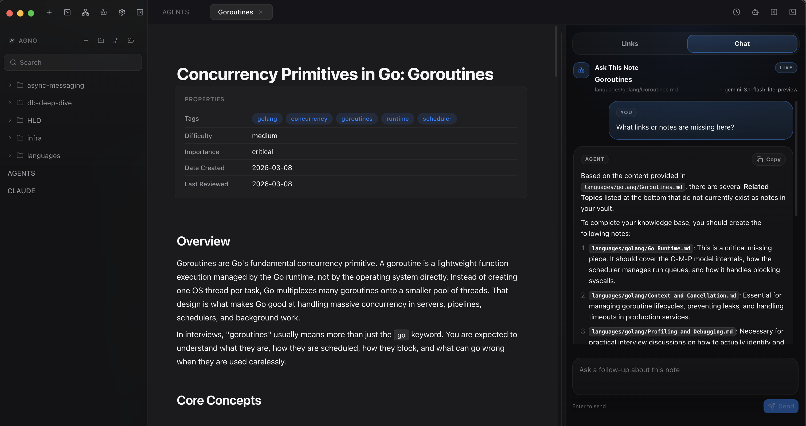

<p align="center">
  
</p>

<h1 align="center">Agno</h1>

<p align="center">
  <strong>A free, open-source cross-platform desktop knowledge base.</strong><br>
  Your notes live as plain markdown files on your machine — not on someone else's server.<br>
  Sync to GitHub for free. No subscriptions. No cloud lock-in. You own your data.
</p>

<p align="center">
  
</p>

---

## Why Agno?

Most knowledge apps charge you monthly just to sync your own notes across devices. Agno takes a different approach — your vault is a folder of markdown files, and syncing happens through GitHub, a tool you already use. No proprietary format, no vendor lock-in, no recurring fees.

### Built-in Terminal

Run your shell without leaving the app. `Cmd+`` ` `` opens a full terminal pane powered by xterm.js — run scripts, commit code, manage your system, all alongside your notes. Position it at the bottom or right side of the window.

### Free Sync via GitHub

One-click sync to any GitHub repo using a personal access token. No OAuth, no third-party services, no $8-10/month sync subscription. Your notes are version-controlled by default.

### Knowledge Graph

See how your ideas connect. An interactive force-directed graph is built automatically from your `[[wiki links]]`, letting you explore relationships between notes visually. Pin nodes, collapse branches, and click to navigate.

### Inline Markdown Editor

Click any block to edit it in place. Markdown renders live with syntax highlighting for 14+ languages. No mode switching, no separate preview pane — just write.

### Wiki Links & Backlinks

Link notes with `[[Note Name]]` syntax. A backlinks panel shows every note that references the current one, and an outgoing links panel shows what it links to — building a personal wiki naturally as you write.

### Version History

Every save is tracked. Browse previous versions of any note and see exactly what changed with a visual diff view. Restore any version with one click.

### Fast Search

Vault-wide fuzzy search (`Cmd+K` / `Cmd+P`) across titles, paths, and content. In-note find (`Cmd+F`) with match highlighting and prev/next navigation.

### Tabs & Split View

Work with multiple notes in tabs — pin them, reorder them, or split into side-by-side view for reference while editing.

### Fully Customizable

Three themes (dark, light, warm), seven accent colors, 13 font families, adjustable font size, line height, and content width. Make it yours.

---

## Keyboard Shortcuts

| Shortcut | Action |
|---|---|
| `Cmd+N` | New note |
| `Cmd+S` | Save |
| `Cmd+O` | Open vault |
| `Cmd+K` / `Cmd+P` | Command palette / quick switcher |
| `Cmd+F` | Find in note |
| `Cmd+,` | Settings |
| `Cmd+\` | Toggle sidebar |
| `Cmd+`` ` `` | Toggle terminal |
| `Cmd+Enter` / `Esc` | Commit inline edit |

## Install

Download the latest installer from [Releases](https://github.com/KnightMode/Agno/releases/latest):
- macOS: `.dmg`
- Windows: `.exe`

> **First launch:** If macOS says it can't verify the developer, go to **System Settings > Privacy & Security**, scroll down, and click **Open Anyway** next to the Agno message.

## Run from Source

Requires Node.js and Xcode command line tools (for `node-pty`).

```bash
npm install
npm run dev
```

## Build

```bash
npm run build
```

Produces platform-specific artifacts in `dist/` (including macOS `.dmg` and Windows `.exe`).

## Stack

- Electron + React 19 + Vite
- Marked + DOMPurify (markdown rendering)
- highlight.js (code syntax highlighting)
- Fuse.js (fuzzy search)
- xterm.js + node-pty (terminal)
- ForceGraph2D (knowledge graph)
- Radix UI + Tailwind CSS (UI components)

## License

MIT
