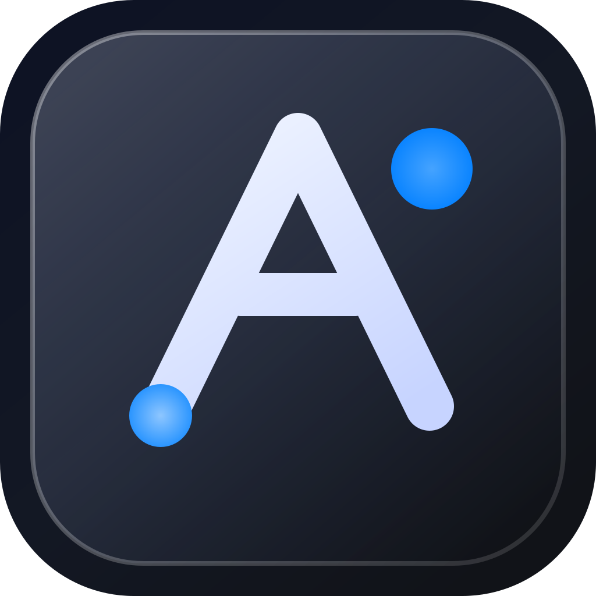
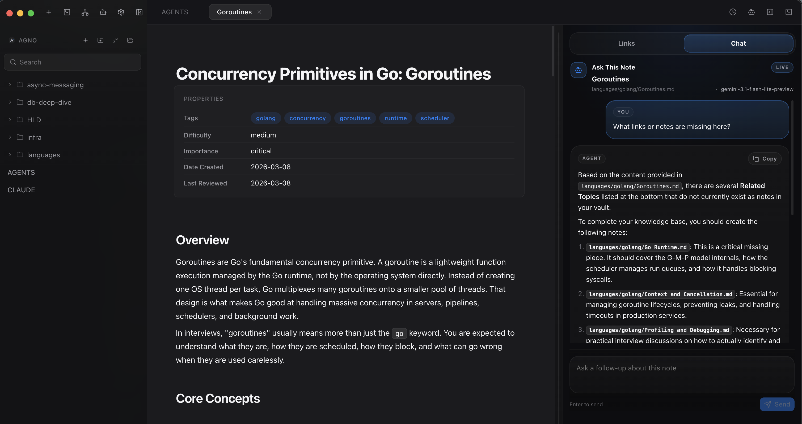
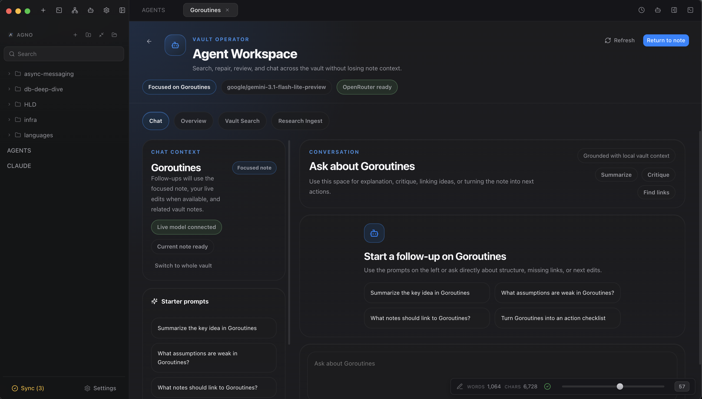

<p align="center">
  
</p>

<h1 align="center">Agno</h1>

<p align="center">
  <strong>A free, open-source, local-first markdown knowledge base with an integrated AI workspace.</strong><br>
  Your notes stay as plain markdown files on your machine. Agno adds grounded vault analysis, note-aware AI follow-ups, free GitHub sync, and a built-in terminal without locking your data into a cloud service.
</p>

<p align="center">
  <strong>Markdown-native</strong> · <strong>Agent-assisted</strong> · <strong>GitHub-synced</strong> · <strong>Terminal included</strong>
</p>

<p align="center">
  <strong>Main Workspace</strong><br>
  <sub>Write, browse your graph, manage tabs, and work in the terminal without leaving the vault.</sub>
</p>

<p align="center">
  <a href="build/hero-main-workspace.png">
    
  </a>
</p>

<p align="center">
  <strong>Agent Workspace</strong><br>
  <sub>Review vault health, run grounded search, chat with note context, and turn research into structured notes.</sub>
</p>

<p align="center">
  <a href="build/agent-workspace-showcase.png">
    
  </a>
</p>

---

## Why Agno?

Agno is for people who want the control of local markdown files without giving up modern AI workflows. The vault stays readable and portable. The app layers search, structure, Git-based sync, and note-aware AI on top.

### The USP

- Local-first by default. Your vault is a normal folder of markdown files, not a proprietary database.
- AI that works on your vault, not around it. Agno analyzes note structure, surfaces stale or broken areas, generates reports, and answers with note-aware context.
- Optional live model, not mandatory SaaS. Bring your own OpenRouter key for chat and follow-ups; the rest of the app still works as a normal local knowledge base.
- Free sync through GitHub. No sync subscription, no cloud lock-in, and built-in version history.
- Terminal built in. Notes, AI workflows, Git, and shell work happen in one desktop app.

## What's New in AI

Agno now includes an integrated **Agent Workspace** built around real vault operations instead of generic chat.

- **Vault health overview**: Analyze note count, broken links, orphan notes, stale notes, untagged notes, and open tasks.
- **Suggested actions**: Fix broken wiki links, create missing notes, and add frontmatter scaffolds with one click.
- **Grounded vault search**: Ask questions against local note content and get linked note matches back.
- **Ask This Note**: Open note-specific chat that uses the visible note plus related vault context.
- **Report generation**: Create a Vault Review or Project Pulse note directly inside the vault.
- **Research ingest**: Paste article text, transcripts, or meeting notes and turn them into a structured research note.
- **Bring-your-own model**: Connect any OpenRouter model in Settings for live agent chat and note follow-ups.

## Core Features

### Agent Workspace

Open the Agent Workspace to review vault health, search across the vault, chat with note context, generate reports, and apply maintenance actions without leaving the app.

### Ask This Note

Each note can open its own chat thread for summaries, critique, missing links, or turning rough notes into next actions. Responses are grounded in the current note and nearby vault context.

### Built-in Terminal

Run your shell without leaving the app. ``Cmd+` `` opens a full terminal pane powered by xterm.js so you can run scripts, commit code, and manage your system alongside your notes.

### Free Sync via GitHub

One-click sync to any GitHub repo using a personal access token. No OAuth, no third-party sync service, and no monthly sync fee. Your notes are version-controlled by default.

### Knowledge Graph

See how your ideas connect. An interactive force-directed graph is built automatically from your `[[wiki links]]`, letting you explore relationships between notes visually.

### Inline Markdown Editor

Click any block to edit it in place. Markdown renders live with syntax highlighting for 14+ languages. No mode switching and no separate preview pane.

### Wiki Links, Backlinks, and Structure

Link notes with `[[Note Name]]` syntax. Backlinks and outgoing links are surfaced automatically, making it easier to build a navigable personal wiki and keep the graph healthy.

### Version History

Every save is tracked. Browse previous versions of any note, inspect a visual diff, and restore an earlier version with one click.

### Fast Search

Vault-wide fuzzy search (`Cmd+K` / `Cmd+P`) across titles, paths, and content. In-note find (`Cmd+F`) with match highlighting and prev/next navigation.

### Tabs & Split View

Work with multiple notes in tabs. Pin them, reorder them, or split them side by side for reference while editing.

### Fully Customizable

Three themes (dark, light, warm), seven accent colors, 13 font families, adjustable font size, line height, and content width.

## How AI Works

- Vault analysis, link checking, report generation, and note scaffolding run against your local markdown vault.
- Live chat and note follow-ups are optional and use a model you choose through OpenRouter.
- Agno is designed to keep answers grounded in note context and to create markdown notes inside your vault when needed.

---

## Keyboard Shortcuts

| Shortcut | Action |
|---|---|
| `Cmd+N` | New note |
| `Cmd+S` | Save |
| `Cmd+O` | Open vault |
| `Cmd+K` / `Cmd+P` | Command palette / quick switcher |
| `Cmd+F` | Find in note |
| `Cmd+,` | Settings |
| `Cmd+\` | Toggle sidebar |
| ``Cmd+` `` | Toggle terminal |
| `Cmd+Enter` / `Esc` | Commit inline edit |

## Install

Download the latest installer from [Releases](https://github.com/KnightMode/Agno/releases/latest):
- macOS: `.dmg`
- Windows: `.exe`

> **First launch:** If macOS says it can't verify the developer, go to **System Settings > Privacy & Security**, scroll down, and click **Open Anyway** next to the Agno message.

## Run from Source

Requires Node.js and Xcode command line tools (for `node-pty`).

```bash
npm install
npm run dev
```

## Build

```bash
npm run build
```

Produces platform-specific artifacts in `dist/` (including macOS `.dmg` and Windows `.exe`).

## Stack

- Electron + React 19 + Vite
- Marked + DOMPurify (markdown rendering)
- highlight.js (code syntax highlighting)
- Fuse.js (fuzzy search)
- xterm.js + node-pty (terminal)
- ForceGraph2D (knowledge graph)
- OpenRouter integration (optional live AI chat)
- Radix UI + Tailwind CSS (UI components)

## License

MIT
